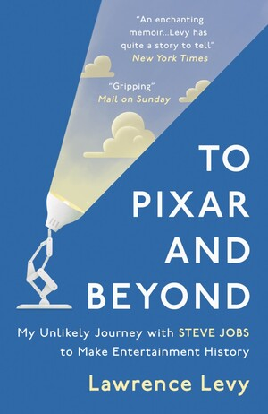

## What I read

To Pixar and Beyond: My Unlikely Journey with Steve Jobs to Make Entertainment History

[Buy it on Amazon](https://www.amazon.com/Pixar-Beyond-Unlikely-Journey-Entertainment-ebook/dp/B01912OSA0)

Author: [Lawrence Levy](http://lawrencelevy.com/)

272 pages

## Summary

This is a very well written book and gives an extremely good insight into Pixar's struggle to become a blockbuster factory and its process of raising an IPO. Apart from that it also painted a completely different picture of Steve Job's style of working.

## Key Quote

<Quote quote="There is nothing you can do about where the pieces are. It's only your next move that matters." />

## Key Takeaways

-   Take things one step at a time. Not all steps require you to take the final decision.
-   Look for someone you can work with and learn from.
-   Look at the business the way a grandmaster looks at a chessboard.
-   Innovation depends on culture.
-   Tiny startups beat big companies because of the culture.
-   Mentors you can trust to give you the right advice when you need a sanity check are important.
-   There are 2 key things you need to get a good deal
    -   **_Leverage_** i.e the assessment of the bargaining power or the strength of the actual hand you have
    -   **_Negotiation_** i.e. how you put the bargaining power to work for you.
-   It's helpful to see what leverage you and the other party have in one place before going into a negotiation.
-   Be crystal clear of what you want out of the negotiation. Don't have a backup position for things that are important to you. However, there a risk of over-reaching so that you end up with nothing.
-   Sometimes a leader has to take the hit to get something meaningful done for the rest of the team.
-   You have to find the Middle Way - the balance between **_structure_** i.e the bureaucrat and **_fluidity_** i.e the artist irrespective of whether its personal or business.

## Recomendation

Even if you are not interested in the movie or animation business, this book is a must-read. It was hard to put down and had some great takeaways.
