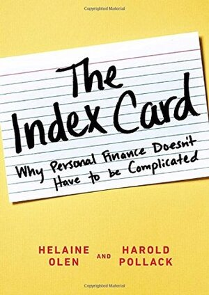

## What I read

The Index Card: Why Personal Finance Doesn’t have to be complicated

[Buy it on Amazon](https://www.amazon.com/Index-Card-Personal-Finance-Complicated/dp/1591847680)

256 pages

Authors: [Helaine Olen](http://helaineolen.com/) and [Harold Pollack](https://twitter.com/haroldpollack)

## Summary

The book is based on the premise that all the financial advice you need to know can fit on an index card. The book is broken down into 9 chapters each of which corresponds to a rule on the index card. Each chapter explains how the rule works accompanied with detailed stories and examples. It is a good book to read if you are just starting to get your financial life in order.

Some of the advice is US-centric but can be applied to other countries as well.

## Key Quote

> This is your financial life. Take control of it.

## Key Takeaways

### Budgeting

-   If you are always worried about your immediate cash flow, you will make mistakes.
-   Do not wait for more than a week to assign expenses to proper categories in your budget.
-   Dividing every expense into categories allows you to see the big picture.

### Saving

-   An emergency fund is a basic foundation for having stability.
-   To gain control over your financial life, pay down the bill with the highest interest rate while paying the required minimum on the rest.
-   Save for retirement after funding your emergency fund.
-   Take full advantage of the retirement account match offered by your employer. It is free money.

### Financial Advice

-   Most financial advisors are salespersons or brokers even if their official title is different.
-   Your neighbourhood brokerage or bank is not the place to get unconflicted financial advice. If you want unconflicted financial advice, you almost certainly have to pay for it.
-   A fiduciary is a financial advisor who has a legal and regulatory duty to put your interests ahead of his or her own. They are also known as a certified financial planner (CFP), registered investment advisor (RIA) or fee-only advisor.
-   You want to seek out an advisor who works on a fee-only basis. This means the advisor is paid by you and only by you. Never assume someone is a fiduciary. Always ask. You need to ask and ask quite specifically: Do you work to the fiduciary standard at all times? This last part, “at all times” is important.

### Investing

-   Don't fall for stories that you can invest in more funds or that it will be easier to monitor your money if it's all in one place.
-   Warren Buffet is an excellent stock picker but he also gets benefits from getting access to deals not available to mere run-of-the-mill investors like the rest of us.
-   “Alternative investments” is a nice way of saying “This is a risky investment”
-   Diversify so that not everything in your investment portfolio rises and falls by the same amount at the same time.
-   If you put money only in supersafe assets that earn low returns you will lose money relative to inflation and increase your risk of outliving your money.
-   Formula to decide how much money to put in stock market funds:
    -   **Percentage of your assets invested in stocks = 100 - your current age**
-   Stock investment Breakdown

    -   70%: A good S & P 500 index fund for assured quick diversification.
    -   15%: A small-cap index fund because they have generally outperformed large-cap funds but have a greater risk.
    -   15%: A broad-based international fund. Make sure that you choose an international fund and not a global fund.
    -   **[Optional]** (5-10%): If you don't own property, a real estate investment trust index fund.

### Housing

-   You should spend no more than a third of your take-home pay on housing.
-   Finance your emergency fund. Then think about purchasing a home.
-   Get your mortgage pre-approved by a bank before you look at the first house.
-   Your house is your home. It is not a speculative investment.
-   There are practical benefits to owning your residence but it is almost always a highly leveraged aka risky investment.
-   If your interest rate drops by less than one percentage point or if you are planning to move soon, it's not worth refinancing.

### Insurance

-   Insurance is a complicated but necessary evil.
-   Get a thirty-year level term life policy.
-   Understand exactly what kind of coverage is contained in the policy you are buying. You need to pose worst-case scenarios to the person selling the policy and then make sure to get their answers in writing.
-   Go for the high-deductible options when buying insurance.
-   Adequate liability insurance is at least twice the amount of your net worth.
-   If you have a high net worth get umbrella insurance which covers the amount of your potential responsibility if you exhaust your liability insurance.

## Other quotes

-   Simplicity takes work and insight to achieve.
-   One of the most important biases is the overconfidence that comes with expertise.
-   Starvation budgets work no better than starvation diets.
-   It's better to save 1 per cent consistently than try and fail over and over again to save 10 to 20 per cent.
-   If it’s free, you are the product.
-   If you sit down for cards, and you don’t know who the sucker is it's you.
-   Popular advice is if we just give up a \$5 small luxury a day, we can retire millionaires. But if that were all it took, most of us would be millionaires already.
-   That's the thing about bubbles and great market runs - Anyone can make money. Until times change or the bubble bursts.
-   The three most important things in a real estate purchase are location, location, and location.

## Recommendation

This book is great if you are just getting started with sorting out your financial life. It explains the different concepts in a very easy to understand way. But for people who are in control of their financial life, this book does not offer anything new.
