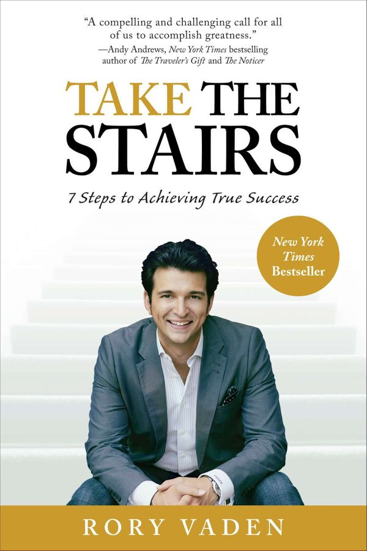

## What I read

Take the Stairs: 7 Steps to Achieving True Success

[Buy it on Amazon](https://www.amazon.com/Take-Stairs-Steps-Achieving-Success/dp/0399537767)

224 pages

Author: [Rory Vaden](https://www.roryvaden.com/)

## Summary

The basic premise of "Take the Stairs" is that we live in a world of people who want to take the easy way in their pursuit of success. The book drives home the reality that self-discipline is necessary to achieve success and that there is no easy path to success. As the author says, it's about taking the stairs instead of the escalator.

The book focuses on understanding and coming to grips with emotions that prevent us from achieving success.

The book is broken down into 7 parts, and each piece has a bunch of short stories and inspirational anecdotes. There are also some action items at the end of the book.

## Key Quote

<Quote quote="Rent Axiom: Success is never owned, it is only rented — and the rent is due every day" />

## Key Takeaways

### Decisions

There are only 2 types of activities.

-   things we feel like doing because it makes us feel good; and
-   things that make sense logically but don't make us feel good.

<Quote quote="A sacrifice isn't really a sacrifice at all; it's just a short-term down payment on a rich future blessing" />

The majority of people make decisions based on emotions and impulses. However, making decisions based on what feels good in the short term requires more work in the end.

<Quote quote="Successful people form the habit of doing things that failures don't like doing" author="Albert Gray" />

Self-discipline is the ability to take action regardless of our emotional, physical or financial state.

Contrary to popular belief, it is not about doing things the hardest way possible; instead, it is about doing the hardest thing as soon as possible.

<Quote quote="Often it is not making the wrong decision that has the greatest cost, but choosing indecision that does" />

Instead of spending our time trying to make the right decisions, we should instead start making decisions and then making them right.

In other words, we should be asking _"How"_ instead of _"Should "_. We should make a list of all the things in our life that are "should-do's" and identify which ones are important enough to be converted into "How will I do's?"

<Quote quote="A challenge in respect to today is a big problem. A challenge in respect to our life span is a small problem. A challenge in respect to eternity is no problem." />

Having a long term perspective allows us to make better decisions. It empowers us with the conviction of knowing that things will work out if we put in the work.

<Quote quote="Faith, therefore, is also choosing to believe that all that is happening today — good or bad — is part of an ultimately greater plan." />

When we do everything that we can, and things still don't work out the way we had hoped for, then we can be sure that they were definitely supposed to go the way they did.

### Time and Energy

Becoming successful requires not only physical energy but also emotional energy.

Often the emotional energy of a decision is greater than the physical energy needed for executing the decision. It is the reason why so many of us give up.

<Quote quote="Peace of mind comes from falling in love with the fact that there is simply and certainly always going to be more to do than we have time for" />

With so many options, deciding how best to spend our time is a significant cause of stress today. Having a schedule allows us to focus our energy on the tasks at hand.

By offloading the thought process of deciding what activities we should or shouldn't spend time on when we are in a logical state, we can avoid spending the time and energy on figuring out what to do next.

<Quote quote="Take pride in controlling the activities that are within your power and to let go of the worry and fear attached to the results that are not." />

Our natural instinct is to want to see the results right away, but there is a gap between the work we put in from being on schedule and when the results start to show up. This delay explains why people often have a hard time sticking to their schedules.

<Quote quote="The most important skill for the next generation of knowledge worker is not learning what to do but rather determining what not to do" />

We should write out a detailed schedule of what our ideal week would look like right now and our ideal week in five years by filling it in the following order.

-   **Rocks**: Start by allocating the time for the harvest periods.
-   **Pebbles**: Thing like sleep and work-meetings around them.
-   **Sand**: Things like email catchup and office time
-   **Water**: Whatever is left and whatever we want to do

### Harvest Periods

<Quote quote='The biggest problem with the notion of balance is that it causes us to ask the wrong questions. Instead of asking, "Am I spending enough time on this. activity?" we should really be asking, "When is the best time to be focused on this activity?' />

Many of us try to spend equal time on all our activities. But it is better to spend appropriate time on critical priorities.

<Quote quote="In business what you don't get done today can be done tomorrow, but with family what doesn't get done today is gone forever" />

We should have **"harvest periods"** in some primary areas of our lives.

-   **Family**: Have one weeknight dedicated as a private date night with a spouse or a child—even if it can only happen with each person once a month
-   **Fitness**: Do some physical activity every day and work out hard for 30 minutes a day three times per week.
-   **Faculty**: Have at least one uninterrupted night per week dedicated to a personal hobby.
-   **Finances**: Review all of our up-to-date financial account balances every Sunday night.

### Focus and Procrastination

<Quote
    quote="In the absence of disciplined focus, we become strangely loyal to performing daily acts of trivia"
    author="Anonymous"
/>

Focus is minimizing the amount of distraction. To achieve focus, we need to manage our thoughts, our words and our behaviour.

One of the most important ways to focus our thoughts is to make the first and last thoughts of the day that inspire us.

<Quote quote="Distraction is a dangerously deceptive saboteur of our goals" />

There are 3 types of procrastination.

-   **Classic Procrastination** is consciously delaying what we know we should be doing.
-   **Creative avoidance** is unconsciously filling the day with menial work by taking things that aren't important and making them urgent.
-   **Priority dilution** is when we take urgent things and inappropriately makes them essential.

People who are struggling with procrastination have one of the following attitudes.

<Quote quote="I’m scared to do it" />

-   We don't challenge ourselves to test our limits because we are afraid, aka **FEAR(False Evidence Appearing Real)**.

<Quote quote="I shouldn't have to do it" />

-   We believe that we are entitled to a life that is supposed to be easier, aka **Entitlement**.

<Quote quote="I won't try to do it if I can't do it right" />

-   We don't take on a challenging task because at least we know we won't fail. So we wait for the perfect plan, the perfect time, and the perfect resources, aka **Perfectionism**.

<Quote quote="The Law of E. F. Hutton — when the real leader speaks, people listen" authoer="John Maxwell" />

There are three ways to get people to take action.

-   The first is to ask them to do it.
-   The second is to force them to do it.
-   The third is to help them recognize for themselves why it's in their best interest to take a particular course of action.

### Vision

<Quote quote="I was doing things right, but I wasn't doing the right things" />

A vision is an inspiring mental picture that propels us to take action. The clarity of what we want, in the long run, is directly proportionate to the levels of our endurance, our intensity of focus and discipline.

We can make a vision board by cutting out inspiring images from magazines and pasting them on a poster board. We shouldn't worry about how it will look to others. We should update the pictures every couple of months to keep them inspiring.

### Commitments

<Quote quote="A life of average, or a life of mediocrity, doesn't come from having a bad attitude. A life of average comes from having an average attitude" />

We should commit to an endeavour until we have maximized our potential then and only then we should evaluate the decision to leave it to try something new.

When we are genuinely committed to an endeavour, there is no chance of turning back because of the unacceptable consequences of doing so. Either the stakes are too high, or the turning back isn't an option.

For unacceptable consequences to be effective, they should be ongoing.

<Quote quote="It does not matter what we say we believe; our real beliefs are revealed by how we act." />

Conditional commitments also us to have flexibility in our lives and be involved in many activities. This works only if the parties involved have a good understanding of what the boundaries are.

<Quote quote="The foundation of a disciplined life is integrity and doing what we say we're going to do" />

Saying either _"I will do..."_ or _"No, I'm sorry; I can't commit to that."_ are much harder to make, but they are much more powerful.

<Quote quote="When it comes to making commitments to other people, sometimes one of the hardest things to learn to say is no when we mean no" />

Intellectual dishonesty is simply allowing someone to believe something that we know is not true. It is tricky to spot because it's not something we say; it's what we don't say.

We can inrease our accountability cultivating it in four different relationships.

-   **Supervisor**: a boss or highly respected mentor.
-   **Subordinate**: an employee or mentee.
-   **Significant** other: a spouse, family member, colleague, best friend, or other trusted peer.
-   **Supporter**: a more objective outside third-party partner who will bring a unique unbiased perspective.

### Impact of Words

Words carry tremendous power if they are chosen with care and intention.

One of the significant causes of pain is that most people don't realize the impact of their words on themselves and others.

Every time we fail to come through on something we said we would do, we weaken the power of our words.

<Quote quote="Compliments create a dynamic of loyalty and positive change" />

Humans have a deep desire to be correct. By genuinely acknowledging someone for an admirable trait or a job well done, we satisfy this desire.

<Quote quote='Whenever you say the word "but", you are negating whatever you said before it' />

The word _"But "_ is a (subconscious) trigger to the listener that everything that came before that word is meaningless.

One of the most damaging times to use the word "but" is when giving feedback or compliments. We might think that we are softening our criticism, but it weakens our praise and our word in general.

<Quote quote="Tell people everything they need to know, and not a word more" author="David Brooks" />

The consequences of gossip are not limited to just the instigator or the subject.

It usually negatively affects those passing it along or even those trying to help by getting in the middle of it.

When two people are in conflict, we should take charge of the situation by making them talk directly to one another.

<Quote quote="Saying whatever we feel and think without first filtering it through the lens of how it might impact the people around us is not transparency; it's indulgence" />

We can harness the power of our word with the following guidelines.

-   Thinking before speaking.
-   Choosing our words carefully
-   Doing what we say we will.
-   Being where we promise we will.
-   Resisting the urge to use emotionally charged language.
-   Assuming the "mic is always on" and that everyone will hear everything we say.
-   Using empowering language when speaking about ourselves and others.

## Other Quotes

<Quote quote="Winning is a habit; unfortunately so is losing" author="Vince Lombardi" />

<Quote quote="Being successful doesn't happen by falling into the most desirable situation possible and somehow magically being discovered for some special uniqueness we have that no one else does" />

<Quote quote="That which is recognized is repeated" author="Christine Roland" />

<Quote quote="Ignore the noise. Conquer the critical. Manage the minutiae" />

<Quote quote="Discipline creates freedom, but timing is everything" author="Randy Gage" />

## Recommendation

The book is easy to read and is ok if you are looking for inspiration, but there is not much to learn. There is nothing new that you would not have already read in other inspirational books.
