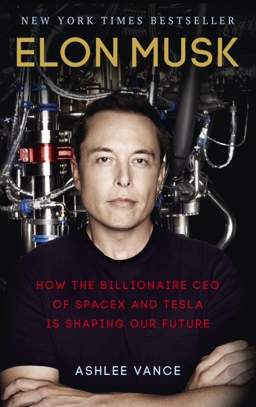

## What I read

[Elon Musk: How the Billionaire CEO of SpaceX and Tesla is Shaping our Future](https://www.amazon.com/Elon-Musk-Billionaire-SpaceX-Shaping-ebook/dp/B00SIDCSWY)

Author: [Ashlee Vance](http://www.ashleevance.com/)

400 pages

Elon Musk: How the Billionaire CEO of SpaceX and Tesla is Shaping our Future

## Summary

This book gives a great insight into Elon Musk as a person as well as into his companies. It starts from Elon's
childhood and goes right up to the current status quo. It reveals the work ethic, the drive and the ruthlessness that
exists within Elon that helps him achieve his goals. As his ex-wife, Justine puts it (in the book) "He does what he
wants and he is relentless about it. Its Elon's world and the rest of us live in it.

Vance strikes a perfect balance between the personal and the professional life of Elon. He does not shie away from
detailing the various challenges and failures that Elon faced. An interesting thing that I learned was that Elon was the
inspiration for Downey's interpretation of Tony Stark. However, I felt that although Elon has been shown as an extremely
hard task-master with little empathy for his employees, the negative stories seem to have been glossed over. I wonder if
that was to keep the aura of Elon Musk intact.

## Key Quote

<Quote
    quote="I think there are probably too many smart people pursuing internet stuff, finance and law. That is part of thereason why we haven't seen as much innovation"
    author="Elon Musk"
/>

## Key Takeaways

-   If you believe in your goals, even if they might sound absurd at the moment, you might be able to achieve them.
-   Sometimes you have to continue even after being told no repeatedly.
-   If rules don't allow you to make progress, you have to fight the rules.
-   If you really want to innovate make things from scratch and try to rethink much that is accepted as convention. You
    can see this with all of Musk's companies in the aerospace, automotive and solar industries.
-   Building big things is a messy business. People will either adore you or despise you.
-   Don't build a Ferrari when an Accord will do.
-   Sometimes, you have to build things in-house, to keep costs down.
-   Pick a plan of attack and if it fails, move on quickly and try a new approach.
-   Scarcity reinforces greed and leads to more interest.
-   At some point, being nice to everyone doesn't work.
-   Asking the right question is hard.
-   How you are perceived at school, is not an indicator of success.
-   You have to do something that has an effect on the world.
-   You have to do something you love to be successful.
-   Nothing matters, if you don't get the product right.
-   The objective should be - "What delivers fundamental value"
-   Word of mouth reviews is critical.
-   Always follow through your commitments, even if they are delayed.
-   Problems can be turned into an excuse to show off dedication to pleasing the customer.
-   Having investors might result in the company losing its vision.
-   If you must rely on investors, try and put a significant amount of money yourself as well.
-   Sometimes, the person who starts the company is not the right person to lead it.
-   Keep an eye out and hire keen and bright people.
-   Trust people to empower them.
-   Get people to own their own work. Then, if they are working hard, they are doing it for themselves, not because you
    told them to.
-   Be careful about how you handle fixing other peoples work. Done incorrectly, It can easily make them unproductive.
-   Let people vent it out when they are upset or angry.
-   If running your own company, don't burden your employees with your financial worries. That does not mean stop
    communicating the importance of being lean and of success.
-   Make sure you remove the obstacles hindering your employees.
-   If interviewing, talk concretely about what you do rather than use buzzwords.
-   Other Notable Quotes
    -   "_The best minds of my generation are thinking about how to make people click ads. That sucks._" - Jeff
        Hammerbacher
    -   "_There needs to be a reason for a grade. I'd rather play video games than try and get the A if there is no
        point._" - Elon Musk
    -   "_The longer you wait to fire someone, the longer it has been since you should have fired them._" - Elon Musk
    -   "_Context matters. Always ask 'How would this sound to [them], knowing what they know?_" - Elon Musk
    -   "_Good ideas are always crazy until they're not_" - Larry Page

## Recommendation

The book makes for a good read and has some interesting takeaways. However, I think it will be tough to apply them if
you do not have a similar personality like Elon. I also didn’t like the fact that it glosses over the people challenges

I don't think it is a book that I will pick up again and again. However, It is worth reading it at least once
